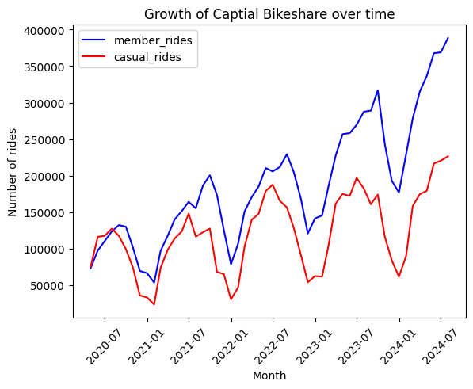
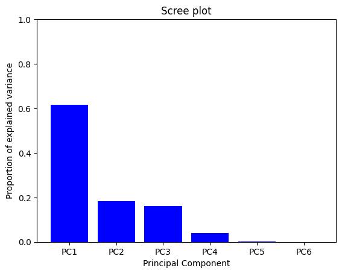

### Project Summary  
This project explores how daily ride activity varies over time and across weather patterns. Using a SQL API, and Python data visualization packages, several aspects of weather data were found to be correlated
with bike demand. Because these variables were also correlated with each other, prinicpal component analysis (PCA) was used to transform the data to a lower dimensional space and remove any colinearity
problems. The transformed dataset was then merged with categorical variables to be used in a random forest regression model. After the model was built, hyperparameters were configured to increase model
bias so that it would generalize well. After building the ideal model its performance was evaluated using test data and found that 81% of the variance in data could be explained by the model.   
   
Figure 1. Trend analysis of Capital Bikeshare demand from 2020 to 2024.   
   
Figure 2. Scree plot showing validity of dimensionality reduction by plotting the proportion of explained variance for each principal component, showing that nearly 95% of changes in demand are attributed to the first three principal components. 
